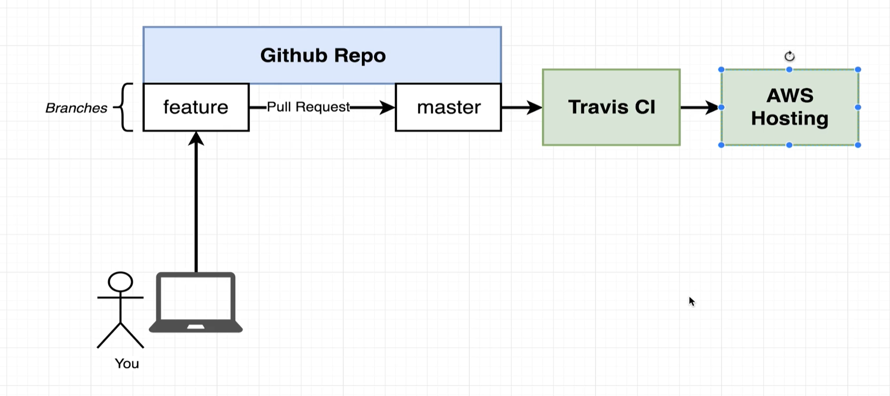
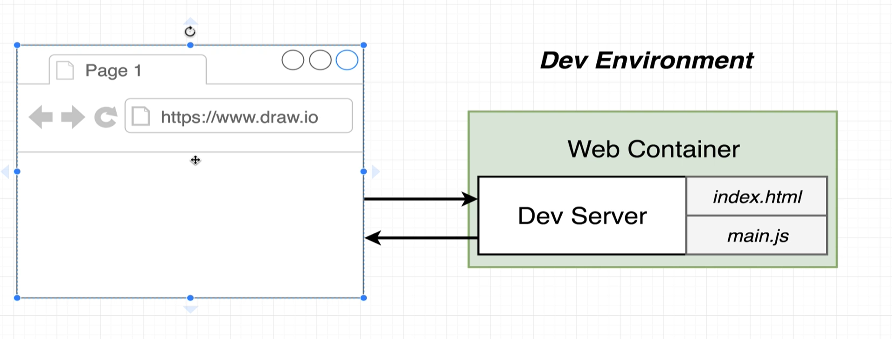
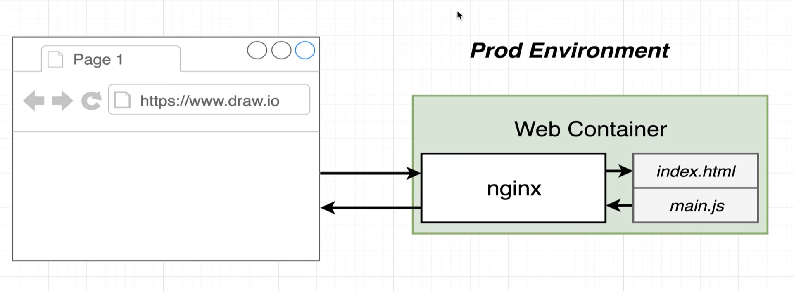
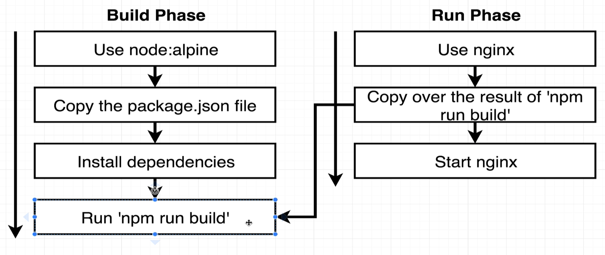

# Development workflow

The idea of this section is to create a development cycle:
- Develop
- Test
- Deploy 
For this we are going to use git and docker. The Github repository will serve as the
central point of coordination for all the code that is going to be written and uploaded
to outside hosting services. The code behind is NOT the sole purpose of this project! 
(done in React)

# Structure
The github repository is going to have to branches. 
## Feature branch
Acts as the development branch of sorts. The code is going to be added to, make changes or
do whatever is needed to update the application
## Master branch 
Represents the clean codebase. Any changes applied to the master branch are going to be 
automatically deployed to our hosting provider.

# Procedure
1. A local machine is going to pull all the latest code from the feature branch.
2. Make some changes into the codebase.
3. Push the changes back to github repository to the feature branch. 
4. After doing so we will request a pull request in order to take all the changes and features added to it to then later add it to the master branch (pull request). This will execute a series of actions that will govern how we manage our codebase. 
5. When the pull request is done and merged to the master, two important events will occurr.
- We are going to set a workflow that it is going to automatically take our app and push it
over to a service called "Travis CLI". What it does is that it pulls our code and runs a set
a set of tests on your code base. This tests have to be written by yourself (relevant to our
application)
- Travis CI after passes all the tests is going to push it to an AWS Elastic Beanstalk.

# In CLI
Folllow the documentation on how to install the latest version of NodeJs
npx create-react-app frontend

# React commands:
npm run start: Starts up a development server (development use only) 
npm run test: Runs tests associated with the project
npm run build: Builds a production version of the app
    This creates a build directory

docker build -f Dockerfile.dev
    Do it after configuring the dockerfile
    Delete the duplicated node_modules in local host

docker run -d -p 3000:3000 -v /app/node_modules -v $(pwd):/app carlostuilm/reactdev
    1. We want this to be a placeholder for a folder that it's inside the container 
    (don't map anything against anything else)
        if we don't do this what will likely happen is that the container won't have
        who does have the node_modules folder will delete it, since the local machine
        does not have it!!
    2. We want to map a folder inside a container to a folder outside the counter
    3. -it flag is needed because by default we only have the stout of the container
    and we need the stdin in order to execute commands inside of it
        Check video 77, to see the limitations of attaching to a container in order to
        see the tests

# PROD ENV setup

npm run build is going to build a production version of the app. It takes all the javascript
files, process them altogether, puts them altogether in a single file and outputs to an speci
fic folder in the host machine. 

This changes the mechanics of how we must treat the production environment.

This diagram shows how the dev environment runs. We have that inside our web container the 
dev sever is running. Whenever our browser makes a request to localhost:3000, it is in fact
doing a request to Dev Server instead. The Dev Server takes the index.html file, the main.js or
other file and takes it to the browser. This means that the Dev Server is 100% required in our
environment.

In the production environment the Dev Server does NOT exists. This is because it is not appropiate
for our production environment (too much unneccesary processing for actual real use)

For this we need a Production Server that it's sole purpose is to respond to browser requests with
the created index.html file and other js files that contains the react app. 

To solve this we need to use NGINX. It's in charge of taking incoming traffic and routing (somehow)
responding to it with some static files. For this we are going to create a third container that it's
going to be our Prod Environment with this server. This production container is going to start an
NGNIX instance that we are going to serve the static files. 

A second Dockerfile that it's going to represent our prod environment has to be created in order to 
do this. We don't want the react dependecies in this server, just the results that it gets. This
Dockerfile will have a multi-step build process that will have to different blocks of configuration.

As shown in the diagram, after getting the results from the "npm run build", this will get copied
in the other phase. When doing that all of the steps done in build phase will be deleted.  

We don't need to specify again the Dockerfile path because this is the predetermined one!
NGINX uses port 80 instead of 3000 like NodeJS. This is the appropiate way of deploying.
NOTE: changes won't appear in realtime in the Prod ENV

# Github setup

